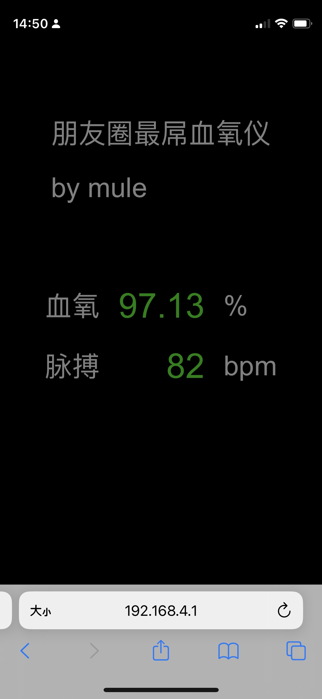
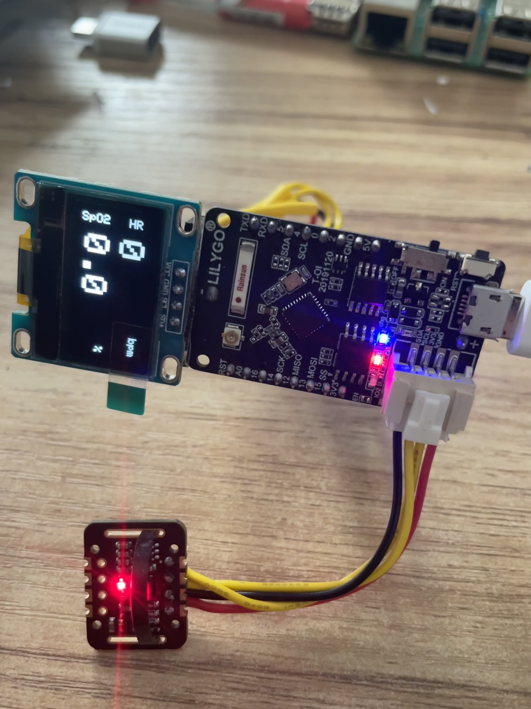
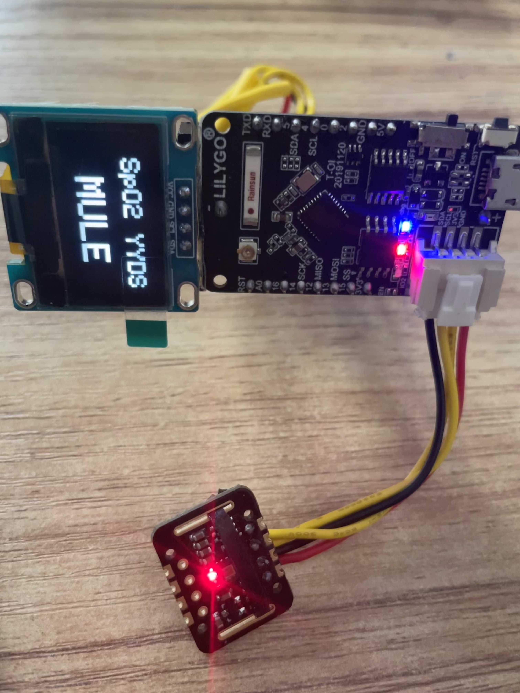

# wifispo2
esp8266+max30102+ssd1306血氧仪

## 可能不是很准，毕竟代码都是扒的，我只是拼了一下
大致用法：手机连接SpO2的wifi，浏览器输入192.168.4.1就可以看到数据了

# 效果：

# 接线参考：

# 参考资料：
https://www.youtube.com/watch?v=b1wNe_9Ikl8

https://github.com/har-in-air/ESP8266_MAX30102_SPO2_PULSE_METER
